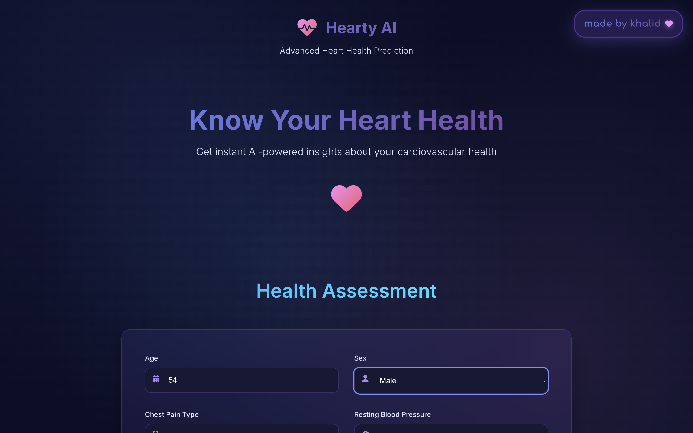
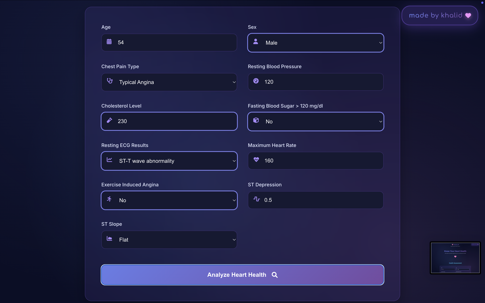
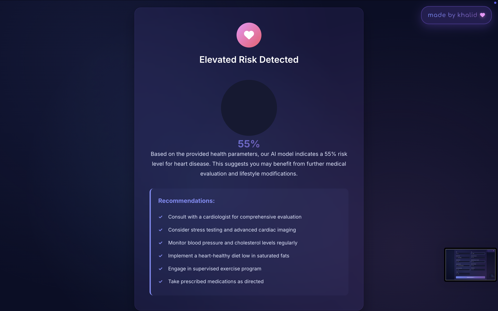

# Hearty AI - Heart Disease Predictor

A beautiful, interactive web application for heart disease prediction using machine learning.

## Features

- 🎨 Modern, gradient-based UI with beautiful animations  
- 🤖 AI-powered heart health predictions using your trained model  
- 📱 Responsive design that works on all devices  
- ⚡ Real-time form validation and interactive feedback  
- 🎯 Personalized recommendations based on risk factors  
- 🔒 Privacy-focused - all data stays on your device  

## 📸 Screenshots

### 🩺 Landing Page – Model Introduction

The landing page introduces **Hearty AI** with a clean design and a clear purpose.  
It highlights the AI-powered prediction capabilities and invites users to assess their heart health.



---

### 📝 Health Assessment Form – Patient Input

This section allows users to enter their personal health data including age, blood pressure, cholesterol level, ECG results, and more.  
All fields are validated instantly for a seamless experience.



---

### 📊 Result View – Model Prediction Output

After submitting the form, users receive a prediction percentage with a risk level.  
Recommendations are tailored based on input data to promote heart health and awareness.



---

## Getting Started

### Prerequisites

- Python 3.7 or higher  
- pip (Python package installer)  

### Installation

1. Create and activate a virtual environment:
   ```bash
   python3 -m venv venv
   source venv/bin/activate  # On Windows: venv\Scripts\activate
